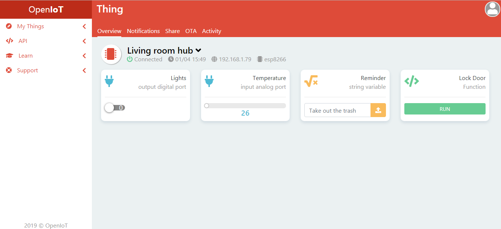

# OpenIoT
> Lightweight open source IoT platform for makers

Control your IoT devices from the cloud with OpenIoT. The platform allows you to update code over the air, set up custom notifications and access its components in real time. OpenIoT currently supports ESP8266 boards with programming using Arduino environment.

## Installation
1. You need an Arduino environment IDE with ESP8266 support. [Arduino IDE][Arduino-IDE] and [PlatformIO][PlatformIO] are recommended.
2. Add the [OpenIoT Library](https://github.com/ItayRosen/OpenIoT/releases) to [Arduino IDE][ArduinoIDEUploadLibrary] or [PlatformIO][PlatformIOUploadLibrary].
3. [Register][Register] on the platform, [add][Add] a new thing and follow the steps for a quick start.

## Usage
> OpenIoT works by attaching components (GPIO, Variables and Functions) to the platform, using the library.

Learn how to use the library in the [docs](https://github.com/ItayRosen/OpenIoT/tree/master/docs/library). Examples can be found in the [examples directory](https://github.com/ItayRosen/OpenIoT/tree/master/examples).

## OTA Updates
> Over the air firmware updates

Future development of the platform will include an IDE (like Arduino Create). Current OTA only allows uploading of a compiled binary file. Future development will also optimize the process and allow a ~70% flash size usage, but current process limits you to 50% flash size. It means that if your board has flash size (PROGRAM) of 4MB, then your sketch can only use 50% of it (2MB). That is because the new firmware has to be stored alongside current firmware for update. You can extract your compiled binary file quite easily with [Arduino IDE][Arduino-IDE-Binary] and [PlatformIO][PlatformIO-Binary].

## Self Hosting
You can host the platform and all communication handling on your own server. You are going to need a linux machine and a firebase account. Check out the [step by step tutorial](docs/self-hosting)

## Supported Boards 
As of now, only ESP8266 is supported. I do wish to add support for as many boards as possible. Any help with this task is appreciated.

* NodeMCU - Before starting to use, make sure you're familiar with its [pinout][nodemcu-pinout].

## To Do
* Bridge pub/sub to Firebase and control MQTT (input + output) from there for better performance.
* Create OTA temp file to allow better usage of flash size.
* Try the library with other ESP8266 boards (Wemos D1, Generic ESP8266 etc)

## Features Roadmap
> Suggestions and "voting" for certain urgancy of different features are welcome.

- [ ] Web IDE - for OTA firmware updates
- [ ] Mobile App
- [ ] Github OTA - push OTA updates from Github
- [ ] API - http api for 3rd party applications
- [ ] Data Charts - log components data on platform and plot charts with it.
- [X] Wifi Manager - add support for Wifi Manager (insert wifi credentials via web server instead of hard-coding)
- [ ] Coding Hub - create applications that can control multiple Things in one code

## Contribute
All contributions and contributors are welcome. If you've ran into issues, please look if there's a similar one opened already. If not, open a new one. Contribution can also be done with future development in the form of:

* Testing the platform environment on different OS and devices.
* Testing the library on different devices (as long they are supported of course).
* Adjusting the library in order to support other devices and environments.
* Help with developing new features.
* Report coding architacture and security issues.

## Library Release History

* 0.1.3
   * Added support for WiFiManager and external wifi management in general.

* 0.1.2
   * Added support for self hosting

* 0.1.1
   * Fixed digital read/write operations

* 0.1.0
    * First release
    
## What's New

* 05/05 - WiFi Manager support added to library
* 02/05 - Self hosting capability added

<!-- Markdown links -->
[Arduino-IDE]: https://www.instructables.com/id/Quick-Start-to-Nodemcu-ESP8266-on-Arduino-IDE/
[PlatformIO]: https://www.instructables.com/id/Introducing-PlatformIO-for-ESP8266/
[Register]: https://platform.openiot.xyz/Register
[Add]: https://platform.openiot.xyz/Newthing
[Arduino-IDE-Binary]: https://randomnerdtutorials.com/bin-binary-files-sketch-arduino-ide/
[PlatformIO-Binary]: https://www.instructables.com/id/Exporting-Binary-bin-File-From-PlatformIO/
[nodemcu-pinout]: https://www.instructables.com/id/NodeMCU-ESP8266-Details-and-Pinout/
[PlatformIOUploadLibrary]: https://community.platformio.org/t/trying-to-understand-how-to-install-custom-local-library/3031/7
[ArduinoIDEUploadLibrary]: https://www.arduino.cc/en/guide/libraries/
